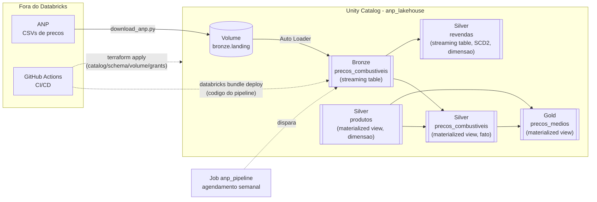
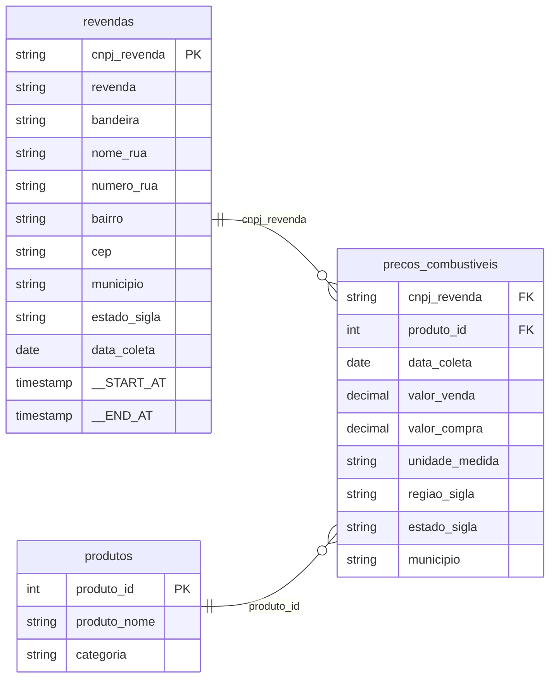

# anp-fuel-lakehouse

Lakehouse medallion (Bronze -> Silver -> Gold) sobre a Serie Historica de Precos de
Combustiveis da ANP, construido no Databricks Free Edition (Unity Catalog +
Lakeflow Declarative Pipelines).

## Escopo

- Ingestao incremental dos CSVs da ANP a partir de um Volume do Unity Catalog.
- Camadas Delta com Auto Loader, deduplicacao/MERGE e agregacoes de negocio.
- Infraestrutura como codigo (Terraform) e CI (GitHub Actions).

## Por que medallion

Reprocessamento auditavel (o dado bruto na Bronze nunca e sobrescrito) e
linhagem ponta a ponta no Unity Catalog, do CSV bruto ate a metrica agregada.

## Arquitetura

Terraform provisiona a infraestrutura (catalog, schemas, volume, grants);
Databricks Asset Bundle publica o codigo do pipeline; o Job dispara a
execucao semanal. Ver secao Governanca abaixo pra quem tem acesso a cada
schema.

## Modelo de dados (Star Schema)

Fato no centro, duas dimensoes ao redor, cada uma com sua chave:

- **Fato `precos_combustiveis`**: 1 linha por observacao de preco. Carrega as
  medidas numericas (`valor_venda`, `valor_compra`) e as chaves estrangeiras
  pras duas dimensoes.
- **Dimensao `revendas`** (SCD Type 2 via AUTO CDC): 1 linha por posto, mas
  com **historico** — troca de bandeira ou endereco gera uma versao nova em
  vez de sobrescrever (`__START_AT`/`__END_AT` controlam a validade de cada
  versao, geradas automaticamente pelo AUTO CDC).
- **Dimensao `produtos`**: dominio pequeno e fixo (os produtos de
  combustivel da ANP), por isso e uma tabela estatica em vez de derivada dos
  dados — padrao comum pra dimensoes de baixa cardinalidade.

## Governanca (Unity Catalog)

Catalog `anp_lakehouse`, schemas `bronze`/`silver`/`gold`, volume de landing
`anp_lakehouse.bronze.landing` (destino dos CSVs crus da ANP).

Acesso concedido por grupo a nivel de schema, herdado por toda tabela criada
dentro dele:

| Grupo | Escopo | Privilegios |
|---|---|---|
| `anp_admins` | catalog `anp_lakehouse` | owner |
| `anp_engineers` | schema `bronze` (+ volume `landing`) | USE_SCHEMA, CREATE_TABLE, CREATE_VOLUME, MODIFY, SELECT, READ_VOLUME, WRITE_VOLUME |
| `anp_engineers` | schemas `silver`, `gold` | USE_SCHEMA, CREATE_TABLE, MODIFY, SELECT |
| `anp_analysts` | schema `gold` | USE_SCHEMA, SELECT (somente leitura, perfil dashboard) |

## Estrutura do repositorio

- `terraform/` - IaC do catalog, schemas, volume e grants no Unity Catalog.
- `src/` - codigo das camadas Bronze/Silver/Gold do Lakeflow Pipeline.
- `resources/` + `databricks.yml` - Databricks Asset Bundle: deploy do codigo
  do pipeline. O job de agendamento (`anp_job`) e gerenciado manualmente pela
  UI (`resources/disabled/anp_job.job.yml` documenta o motivo).
- `download/` - script de download dos CSVs da ANP.
- `tests/` - testes unitarios do script de download.
- `.github/workflows/` - CI (lint + testes + `terraform validate` sempre;
  deploy no push pra `main`, condicional aos secrets `DATABRICKS_HOST` e
  `DATABRICKS_TOKEN` no repositorio).